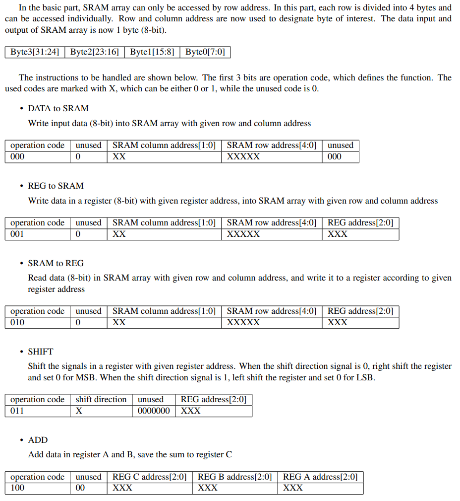
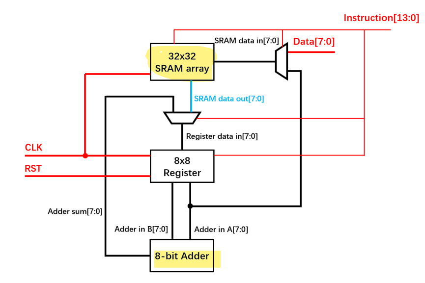
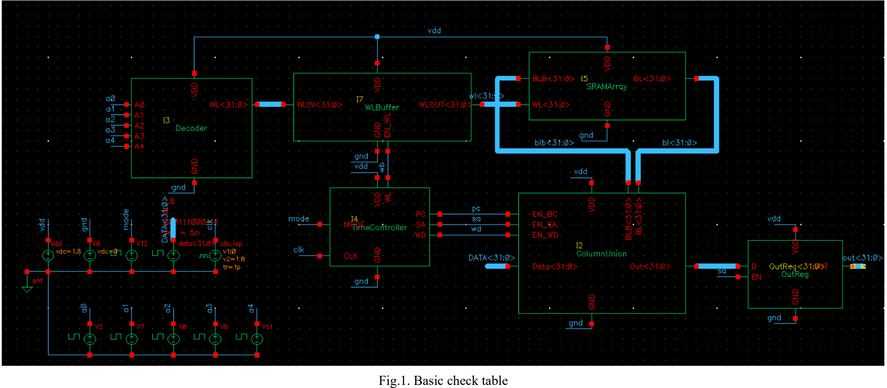
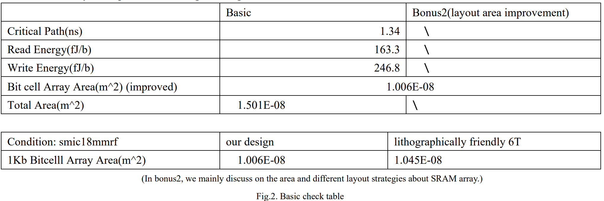
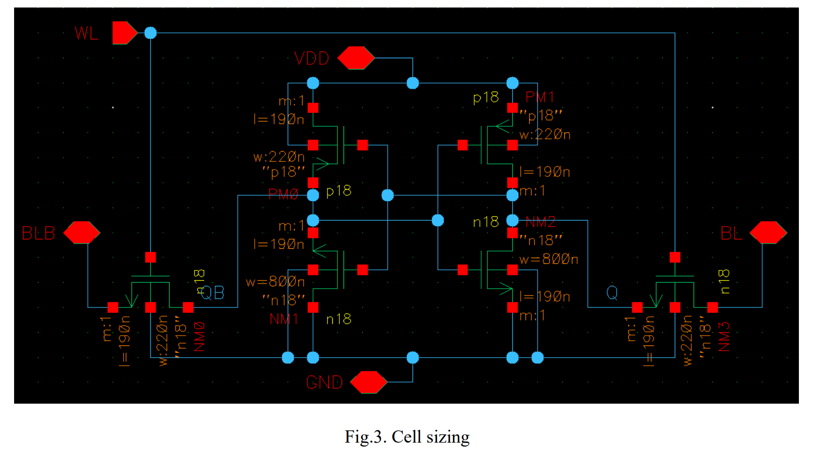
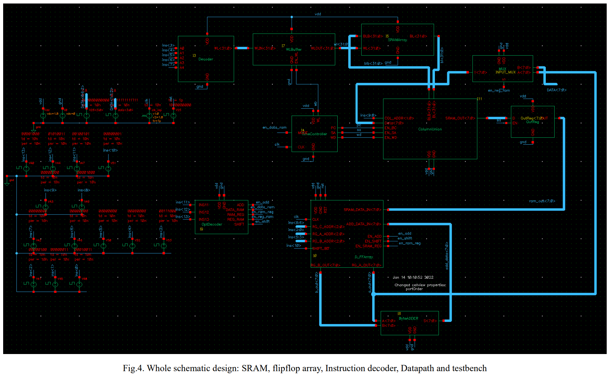
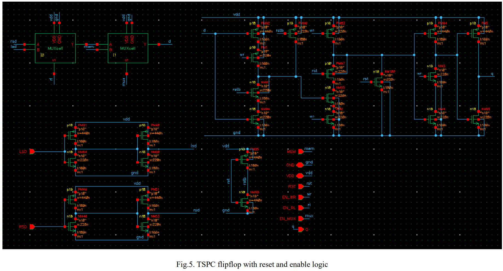
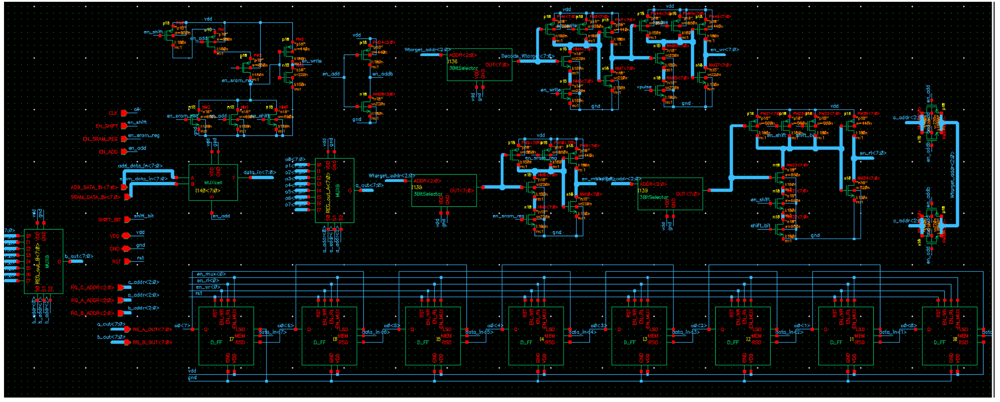
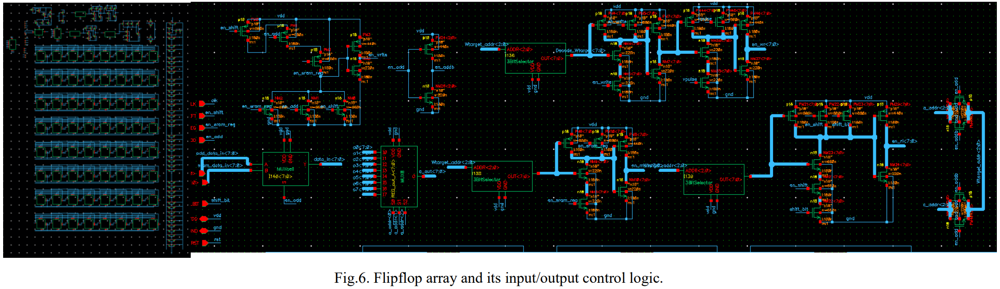
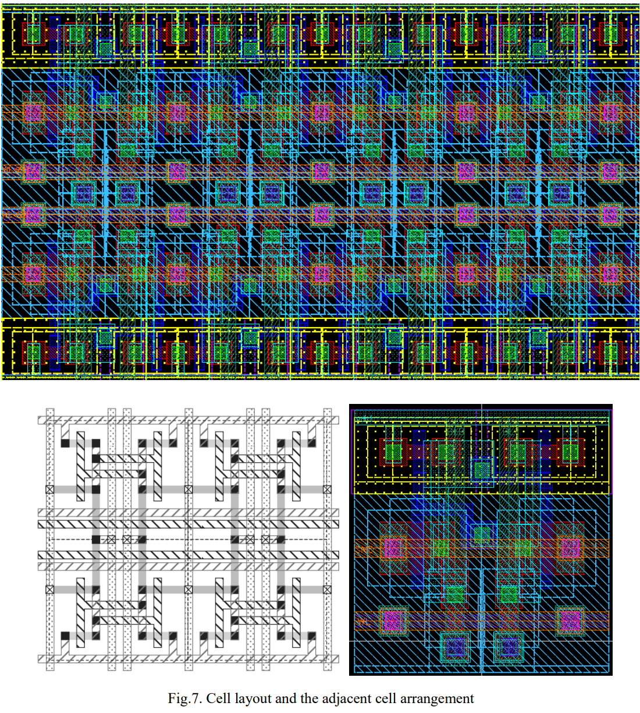

# EE113_Digital-Integrated-Circuit-I
Shanghaitech EE113 Project:  

SRAM with Layout Improvement and Instruction Set (With bonus 1 & 2)  

Check the taskbooks and report for details.

---

### Gallery

Some core figures:

